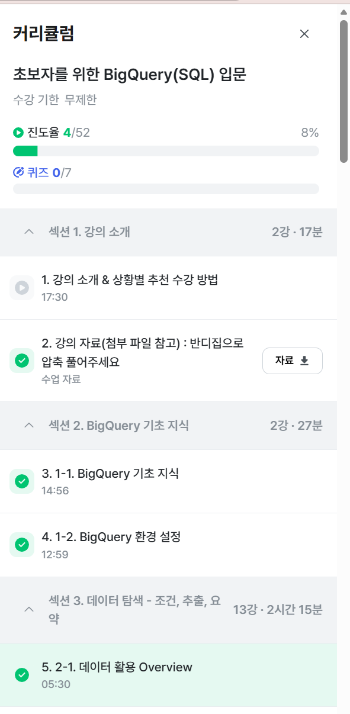

# 📘 SQL_BASIC 1주차 정규 과제

SQL_BASIC 정규 과제는 매주 정해진 분량의 `초보자를 위한 BigQuery(SQL) 입문` 강의를 듣고, 핵심 개념을 정리한 뒤 간단한 SQL 문제를 직접 풀어보는 방식으로 진행합니다.

이번 주는 BigQuery 환경과 SQL의 기본 구조를 익히고, 데이터가 어떤 형태로 저장되고 활용되는지 생각해봅니다.

완성된 과제는 Github에 업로드하고, 링크를 스프레드시트 'SQL' 시트에 입력해 제출해주세요.

**👀 수행 인증란은 필수입니다.**

---

## 📚 SQL_BASIC_1st_TIL

### 섹션 2. BigQuery 기초 지식

### 1-1. BigQuery 기초 지식

### 1-2. BigQuery 환경 설정

### 섹션 3. 데이터 탐색 - 조건, 추출, 요약

### 2-1. 데이터 활용 Overview

---

## ✨ 선택 강의

- 1. 강의 소개 & 상황별 추천 수강 방법 미리보기: 강의 전체 구성과 수강 방향을 확인하고 싶을 때 선택 수강

---

## 🏁 전체 강의 수강 계획

| 주차 | 필수 강의 범위 | 선택 강의 | 완료 여부 |
| --- | --- | --- | --- |
| 1주차 | 1-1 ~ 2-1 | 1 | ✅ |
| 2주차 | 2-2 ~ 2-3 | 2-4 | 🍽️ |
| 3주차 | 2-5, 2-7 ~ 2-8 | 2-6 | 🍽️ |
| 4주차 | 3-2 ~ 4-3 | 3-4 | 🍽️ |
| 5주차 | 4-4 ~ 4-6 | 4-5, 4-7 | 🍽️ |
| 6주차 | 5-2 ~ 5-5 | 5-6 | 🍽️ |
| 7주차 | 필수 강의 없음 | 6-2, 6-3, 6-4, 6-5 | 🍽️ |

---

<br>

<!-- 여기까진 그대로 둬 주세요-->

---

# 1️⃣ 개념 정리

아래 키워드 중 중요하다고 생각한 개념을 2개 이상 골라 짧게 정리해주세요. 3개보다 더 많이 정리하고 싶다면 자유롭게 항목을 추가해도 좋습니다.

이번 주 키워드:
- SQL
- BigQuery
- Database
- Table
- Row
- Column
- 데이터 활용 과정

## 01.

```
개념 이름: SQL
개념 설명: 데이터베이스의 데이터를 관리하기 위해 설계된 특수목적의 프로그래밍 언어 
활용 상황: 데이터베이스에서 데이터를 가지고 올때 사용
```

## 02.

```
개념 이름: 행 Row
개념 설명: 하나의 row가 하나의ㅡ 고유한 데이터 
활용 상황: 테이블에 저장된 데이터의 형태로써 기능
```

## (선택) 03.

```
개념 이름: BigQuery 
개념 설명: Google Cloud의 OLAP + Data Warehouse 
활용 상황: SQL 통해 쉽게 데이터 추출 가능
```

---

# 2️⃣ 수행 인증란

아래 중 하나 이상을 첨부해주세요.

- 강의 수강 화면 캡처

- 이번 주 학습 내용을 정리한 노트 캡처

---

# 3️⃣ 확인 문제

## 🧩 문제 1

포켓몬 게임이나 이커머스 산업과 같이 다양한 산업에서는 각기 다른 데이터가 존재합니다. 다음 중 하나의 산업을 선택하고, 해당 산업에서 수집하고 활용될 수 있는 데이터 항목, 즉 컬럼 5가지를 자유롭게 상상하여 나열해주세요.

예시 산업:
- 온라인 음식 배달
- 스마트 헬스 케어
- 중고 거래 앱
- 교육 플랫폼

풀이 과정:

```
- 선택한 산업: 온라인 음식 배달
- 떠올린 컬럼 5가지: user_id, order_id, restaurant_id, total_amount, order_datetime
- 해당 컬럼이 필요하다고 생각한 이유: 가장 핵심적인 기본 데이터이기 때문 
```

## 🧩 문제 2

이번 강의를 통해 SQL이 왜 필요하다고 느끼는지, SQL을 통해 본인이 어떤 것을 해내고 싶은지를 자유롭게 작성해주세요.

풀이 과정:

```
- SQL이 필요하다고 느낀 이유: 대용량의 데이터를 원하는 형태로 가공하기 위해서 필요하다고 느꼈습니다. 
- SQL로 해보고 싶은 일: 실제 데이터를 직접 쿼리해가며 트렌드 등을 분석해보고 싶습니다.
- 앞으로 SQL을 공부할 때 기대되는 점: 점점 익숙해졌으면 좋겠습니다.
```

---

# 4️⃣ 이번 주 회고

```
1. SQL을 처음 써보면서 가장 낯설었던 점: 테이블 생성시 파티셔닝 세부 설정
2. 다음 주에 더 익숙해지고 싶은 부분: 기본 쿼리 문법
3. 과제 진행 중 막혔던 부분이 있다면: 강의 영상의 구버전 화면과 현재 빅쿼리 UI가 달라 테이블 생성과 파티션 설정 메뉴를 찾을때 살짝 헤맸습니다.
```

수고하셨습니다!


