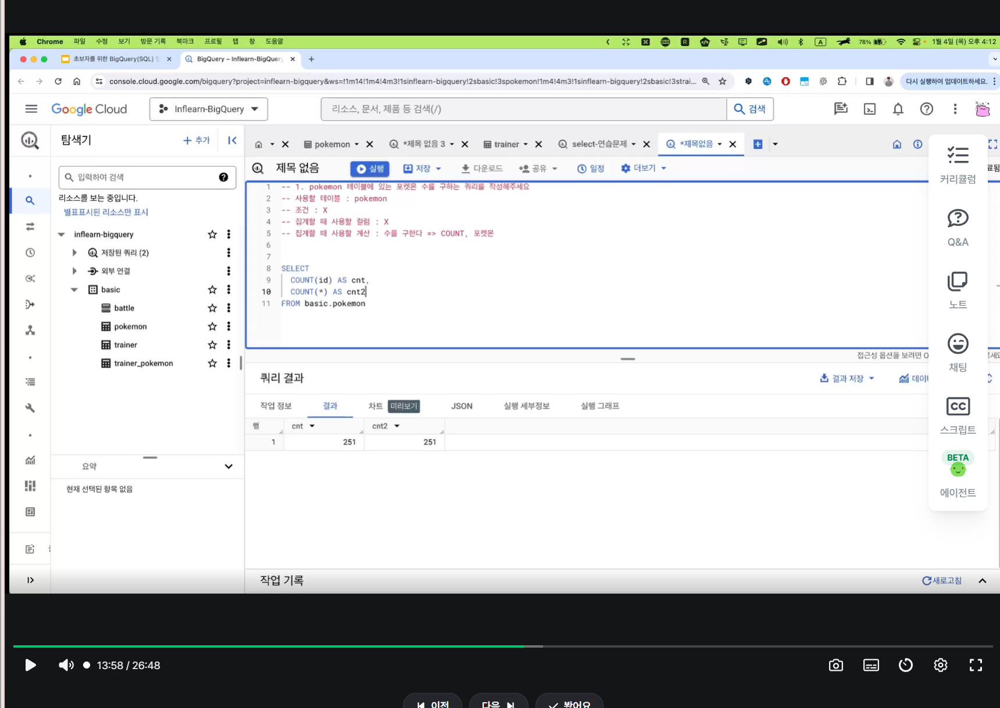
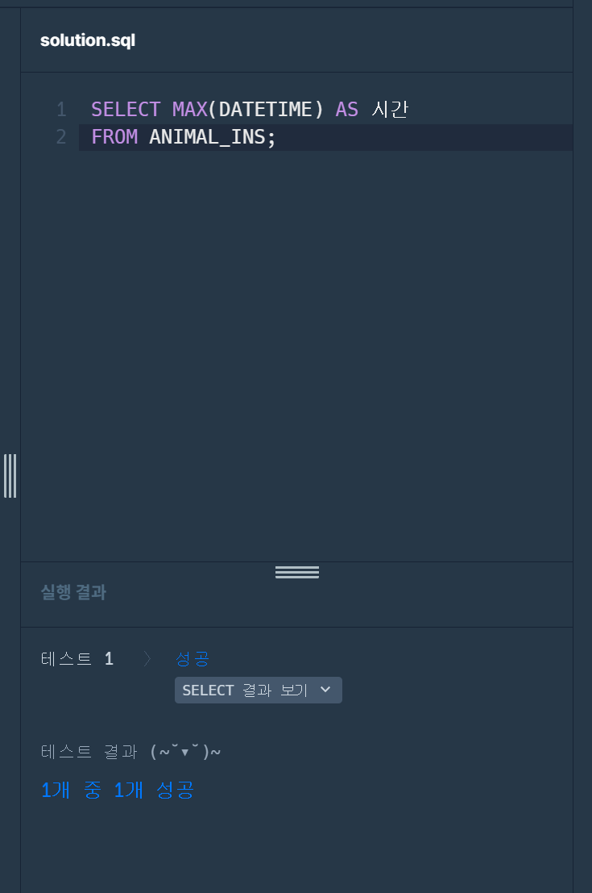
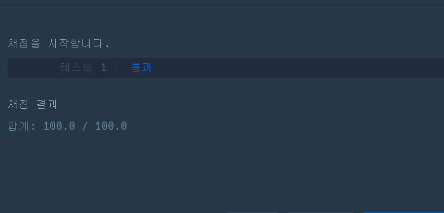
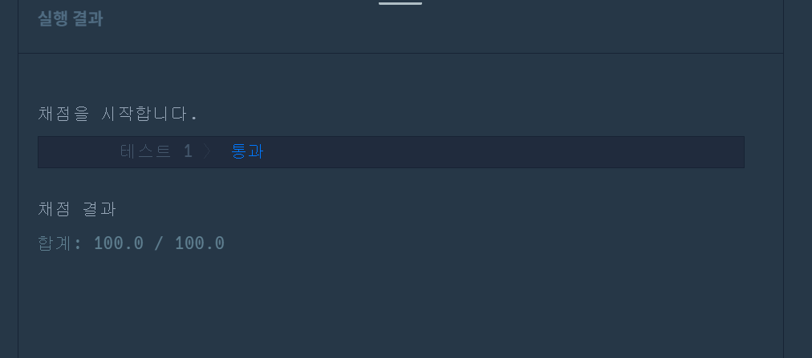

# 📘 SQL_BASIC 3주차 정규 과제

SQL_BASIC 정규 과제는 매주 정해진 분량의 `초보자를 위한 BigQuery(SQL) 입문` 강의를 듣고, 핵심 개념을 정리한 뒤 간단한 SQL 문제를 직접 풀어보는 방식으로 진행합니다.

이번 주는 집계 함수와 `GROUP BY`, `HAVING`을 학습합니다.

완성된 과제는 Github에 업로드하고, 링크를 스프레드시트 'SQL' 시트에 입력해 제출해주세요.

**👀 수행 인증란은 필수입니다.**

---

## 📚 SQL_BASIC_3rd_TIL

### 섹션 3. 데이터 탐색 - 조건, 추출, 요약

### 2-5. 집계(GROUP BY + HAVING + SUM/COUNT)

### 2-7. 정리

### 2-8. 새로운 집계 함수 소개(GROUP BY ALL, 2024-02-26에 나온 함수)
ddf
---
어
## ✨ 선택 강의

- 2-6. 연습 문제: 집계와 조건 조회를 더 연습하고 싶을 때 선택 수강

---

## 🏁 전체 강의 수강 계획

| 주차 | 필수 강의 범위 | 선택 강의 | 완료 여부 |
| --- | --- | --- | --- |
| 1주차 | 1-1 ~ 2-1 | 1 | ✅ |
| 2주차 | 2-2 ~ 2-3 | 2-4 | ✅ |
| 3주차 | 2-5, 2-7 ~ 2-8 | 2-6 | ✅ |
| 4주차 | 3-2 ~ 4-3 | 3-4 | 🍽️ |
| 5주차 | 4-4 ~ 4-6 | 4-5, 4-7 | 🍽️ |
| 6주차 | 5-2 ~ 5-5 | 5-6 | 🍽️ |
| 7주차 | 필수 강의 없음 | 6-2, 6-3, 6-4, 6-5 | 🍽️ |

---

<br>

<!-- 여기까진 그대로 둬 주세요-->

---

# 1️⃣ 개념 정리

아래 키워드 중 중요하다고 생각한 개념을 2개 이상 골라 짧게 정리해주세요. 3개보다 더 많이 정리하고 싶다면 자유롭게 항목을 추가해도 좋습니다.

이번 주 키워드:
- COUNT
- SUM
- AVG
- MAX
- MIN
- GROUP BY
- HAVING
- 집계 기준

## 01. 집계 함수: COUNT, SUM, AVG, MAX, MIN

**개념 설명:** 여러 행의 데이터를 개수, 합계, 평균 등의 하나의 값으로 요약하는 함수이다.

| 함수 | 의미 | 예시 |
| --- | --- | --- |
| `COUNT(*)` | 전체 행의 개수 | 전체 동물 수 |
| `COUNT(NAME)` | NAME이 NULL이 아닌 행의 개수 | 이름이 있는 동물 수 |
| `COUNT(DISTINCT NAME)` | NULL을 제외한 서로 다른 이름의 개수 | 중복을 제거한 이름 수 |
| `SUM(PRICE)` | 가격의 합계 | 상품 가격 합계 |
| `AVG(PRICE)` | 가격의 평균 | 평균 상품 가격 |
| `MAX(PRICE)` | 가격의 최댓값 | 가장 비싼 상품 가격 |
| `MIN(PRICE)` | 가격의 최솟값 | 가장 저렴한 상품 가격 |

**예시 쿼리:** 아래 예시는 `PRODUCT` 테이블에 상품별 가격인 `PRICE` 컬럼이 있다고 가정한다.

```sql
SELECT
    COUNT(*) AS product_count,
    SUM(PRICE) AS total_price,
    AVG(PRICE) AS avg_price,
    MAX(PRICE) AS max_price,
    MIN(PRICE) AS min_price
FROM PRODUCT;
```

**헷갈리기 쉬운 점:** `COUNT(*)`는 NULL이 있는 행도 세지만, `COUNT(컬럼)`은 해당 컬럼이 NULL인 행을 제외한다. `SUM`, `AVG`, `MAX`, `MIN`도 NULL을 제외하고 계산한다. 예를 들어 값이 `10, 20, NULL`이면 `AVG`는 `30 / 2 = 15`이다.

## 02. GROUP BY와 집계 기준

**개념 설명:** 같은 값을 가진 행끼리 묶고, 각 그룹별로 집계한다. 집계 기준은 “무엇별로 결과를 구할 것인가?”에 해당한다.

**예시 쿼리:** `ANIMAL_INS` 테이블에서 동물 종류별 마릿수를 구한다.

```sql
SELECT
    ANIMAL_TYPE,
    COUNT(*) AS animal_count
FROM ANIMAL_INS
GROUP BY ANIMAL_TYPE;
```

- `GROUP BY` 없이 `COUNT(*)`만 조회하면 전체 동물 수를 한 행으로 반환한다.
- `GROUP BY ANIMAL_TYPE`을 사용하면 종류마다 한 행씩 반환한다.
- `GROUP BY ANIMAL_TYPE, SEX_UPON_INTAKE`처럼 기준을 추가하면 두 값의 조합별로 더 세분화된다.

**헷갈리기 쉬운 점:** 기본적인 집계 쿼리에서는 `SELECT`에 조회하는 일반 컬럼을 `GROUP BY`에도 넣어야 한다. 종류별로 묶으면서 개별 동물의 `NAME`을 그대로 조회하면, 그룹을 대표할 이름을 정할 수 없어 오류가 발생한다.

## 03. HAVING과 WHERE의 차이

**개념 설명:** `WHERE`는 집계하기 전 개별 행을 걸러내고, `HAVING`은 집계한 후 그룹을 걸러낸다.

| 구분 | WHERE | HAVING |
| --- | --- | --- |
| 필터링 대상 | 개별 행 | 집계된 그룹 |
| 적용 시점 | 그룹화 전 | 그룹화 후 |
| 조건 예시 | `ANIMAL_TYPE = 'Cat'` | `COUNT(*) >= 2` |

**예시 쿼리:** 이름이 있는 동물만 모은 뒤, 종류별로 2마리 이상인 그룹을 조회한다.

```sql
SELECT
    ANIMAL_TYPE,
    COUNT(*) AS animal_count
FROM ANIMAL_INS
WHERE NAME IS NOT NULL
GROUP BY ANIMAL_TYPE
HAVING COUNT(*) >= 2
ORDER BY animal_count DESC;
```

**헷갈리기 쉬운 점:** 이 쿼리의 `WHERE`에서는 아직 그룹별 개수를 계산하지 않았으므로 `WHERE COUNT(*) >= 2`라고 쓸 수 없다. 그룹별 집계 결과에 조건을 적용할 때는 `HAVING`을 사용한다.

## 04. GROUP BY ALL

**개념 설명:** BigQuery에서 `SELECT` 항목을 바탕으로 그룹화 기준을 자동으로 추론하는 구문이다. 집계 함수 자체가 아니라 `GROUP BY`의 작성 방식이다.

**예시 쿼리:** 아래에서는 `COUNT(*)`를 제외한 `ANIMAL_TYPE`이 그룹화 기준이 된다.

```sql
SELECT
    ANIMAL_TYPE,
    COUNT(*) AS animal_count
FROM ANIMAL_INS
GROUP BY ALL;
```

이 예시는 `GROUP BY ANIMAL_TYPE`과 같은 결과를 만든다. 집계 함수, 윈도 함수, 상수 등은 기준 추론에서 제외된다. `SELECT`에 일반 컬럼을 추가하면 집계 기준도 달라질 수 있으므로, 결과가 무엇별로 묶이는지 확인해야 한다.

## 05. 쿼리 작성 순서와 이해 순서

**작성 순서:**

```sql
SELECT 컬럼, 집계함수
FROM 테이블
WHERE 개별_행_조건
GROUP BY 집계_기준
HAVING 그룹_조건
ORDER BY 정렬_기준
LIMIT 개수;
```

위 코드는 구조를 보여주는 틀이며, 필요하지 않은 절은 생략할 수 있다.

**이해를 위한 논리적 처리 순서:** `FROM → WHERE → GROUP BY 및 집계 → HAVING → SELECT → ORDER BY → LIMIT`

데이터를 가져오고 → 필요한 행을 고르고 → 기준별로 묶어 계산하고 → 조건에 맞는 그룹을 남기고 → 출력할 값을 정하고 → 정렬하고 → 출력 개수를 제한한다고 이해하면 된다. 실제 내부 실행 방식은 최적화에 따라 달라질 수 있다.


---

# 2️⃣ 수행 인증란

아래 중 하나 이상을 첨부해주세요.



---

# 3️⃣ 확인 문제

프로그래머스는 로그인이 필요하므로, 로그인 후 문제 풀이를 진행해주세요.

## 🧩 문제 1

문제 링크: [최댓값 구하기](https://school.programmers.co.kr/learn/courses/30/lessons/59415)

풀이 과정:풀이 과정: 가장 최근에 들어온 동물의 입소 시점을 구해야 하므로, 보호 시작일이 저장된 DATETIME 컬럼을 확인했다. 날짜와 시간 값 중 가장 큰 값이 가장 최근 시점이므로 MAX 함수를 사용했다. SELECT MAX(DATETIME) AS 시간 FROM ANIMAL_INS로 작성하여 최근 보호 시작일 하나를 조회했다.

```
- 문제 요구사항: ANIMAL_INS 테이블에서 가장 최근에 들어온 동물의 보호 시작 날짜와 시간을 조회한다.
- 사용한 SQL 절: SELECT와 FROM을 사용하고, MAX(DATETIME)으로 가장 최근 보호 시작일을 구했다.
- 새로 배운 점: MAX는 숫자뿐 아니라 날짜와 시간에도 사용할 수 있으며, 날짜에 적용하면 가장 최근 값을 반환한다.
```



## 🧩 문제 2

문제 링크: [가장 비싼 상품 구하기](https://school.programmers.co.kr/learn/courses/30/lessons/131697)

풀이 과정: 가장 높은 판매가를 구해야 하므로 PRODUCT 테이블의 PRICE 컬럼에 MAX 함수를 적용했다. 문제에서 요구한 출력 컬럼명은 AS를 사용해 MAX_PRICE로 지정했다

```
사용한 집계 함수: 최댓값을 구하는 MAX 함수
집계 대상 컬럼: PRODUCT 테이블의 판매가를 나타내는 PRICE 컬럼
결과를 검증한 방법: PRICE를 내림차순으로 정렬한 뒤 첫 번째 가격과 MAX(PRICE)의 결과가 같은지 비교하면 검증할 수 있다.
```



## 🧩 문제 3

문제 링크: [고양이와 개는 몇 마리 있을까](https://school.programmers.co.kr/learn/courses/30/lessons/59040)

풀이 과정: ANIMAL_INS 테이블에서 WHERE로 고양이와 개만 선택하고, GROUP BY ANIMAL_TYPE으로 동물 종류별로 묶었다. COUNT(*)로 각 종류의 마릿수를 계산한 뒤, 고양이(Cat)가 개(Dog)보다 먼저 나오도록 ANIMAL_TYPE을 오름차순 정렬했다.

```
그룹화 기준: 동물 종류를 나타내는 ANIMAL_TYPE 컬럼
WHERE와 HAVING 중 사용한 절: 집계 전에 고양이와 개에 해당하는 행만 선택하기 위해 WHERE를 사용했다.
처음 틀렸다면 틀린 이유: 실제 오답 경험이 있다면 작성하고, 없다면 생략한다.
새로 배운 SQL 패턴: GROUP BY와 COUNT(*)를 함께 사용하면 종류별 개수를 구할 수 있고, ORDER BY로 결과의 출력 순서를 지정할 수 있다.
```



---

# 4️⃣ 이번 주 회고

```
1. 문제를 SQL로 옮길 때 가장 어려웠던 부분: 전체 데이터에서 최댓값 하나를 구하는 경우와 종류별로 개수를 구하는 경우를 구분하는 것이 어려웠다. 무엇을 기준으로 묶어야 하는지 먼저 생각하면서 GROUP BY가 필요한지 판단했다.
2. WHERE와 HAVING의 차이를 어떻게 이해했는지: WHERE는 집계 전에 개별 행을 걸러내고, HAVING은 집계 후 그룹에 조건을 적용한다고 이해했다. 고양이와 개만 선택할 때는 WHERE를, 종류별 마릿수가 일정 수 이상인 그룹만 조회할 때는 HAVING을 사용한다.
3. 다음 주에 더 연습하고 싶은 문제 유형: GROUP BY로 기준별 데이터를 묶고 COUNT, SUM, AVG로 집계하는 문제와 WHERE, HAVING을 함께 사용하는 문제를 더 연습하고 싶다.
```

수고하셨습니다!


