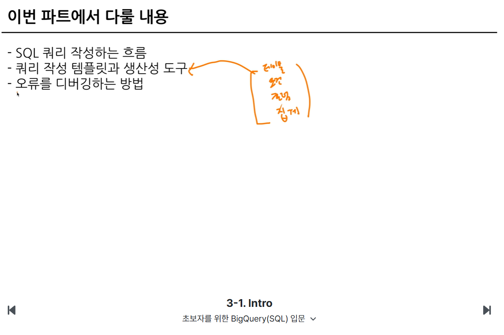

# 📘 SQL_BASIC 4주차 정규 과제

SQL_BASIC 정규 과제는 매주 정해진 분량의 `초보자를 위한 BigQuery(SQL) 입문` 강의를 듣고, 핵심 개념을 정리한 뒤 간단한 SQL 문제를 직접 풀어보는 방식으로 진행합니다.

이번 주는 SQL 쿼리를 작성하는 흐름, 쿼리 작성 템플릿, 데이터 타입 변환, 문자열 함수를 학습합니다.

완성된 과제는 Github에 업로드하고, 링크를 스프레드시트 'SQL' 시트에 입력해 제출해주세요.

**👀 수행 인증란은 필수입니다.**

---

## 📚 SQL_BASIC_4th_TIL

### 섹션 4. SQL 쿼리 잘 작성하기, 쿼리 작성 템플릿 및 오류를 잘 디버깅하기

### 3-2. SQL 쿼리를 작성하는 흐름

### 3-3. 쿼리 작성 템플릿과 생산성 도구

### 섹션 5. 데이터 탐색 - 변환

### 4-1. INTRO

### 4-2. 데이터 타입과 데이터 변환(CAST, SAFE_CAST)

### 4-3. 문자열 함수(CONCAT, SPLIT, REPLACE, TRIM, UPPER)

---

## ✨ 선택 강의

- 3-4. 오류를 디버깅하는 방법: 오류 메시지 해석과 디버깅 흐름을 더 익히고 싶을 때 선택 수강

---

## 🏁 전체 강의 수강 계획

| 주차 | 필수 강의 범위 | 선택 강의 | 완료 여부 |
| --- | --- | --- | --- |
| 1주차 | 1-1 ~ 2-1 | 1 | ✅ |
| 2주차 | 2-2 ~ 2-3 | 2-4 | ✅ |
| 3주차 | 2-5, 2-7 ~ 2-8 | 2-6 | ✅ |
| 4주차 | 3-2 ~ 4-3 | 3-4 | ✅ |
| 5주차 | 4-4 ~ 4-6 | 4-5, 4-7 | 🍽️ |
| 6주차 | 5-2 ~ 5-5 | 5-6 | 🍽️ |
| 7주차 | 필수 강의 없음 | 6-2, 6-3, 6-4, 6-5 | 🍽️ |

---

<br>

<!-- 여기까진 그대로 둬 주세요-->

---

# 1️⃣ 개념 정리

아래 키워드 중 중요하다고 생각한 개념을 2개 이상 골라 짧게 정리해주세요. 3개보다 더 많이 정리하고 싶다면 자유롭게 항목을 추가해도 좋습니다.

이번 주 키워드:
- 쿼리 작성 순서
- 쿼리 작성 템플릿
- 데이터 타입
- CAST
- SAFE_CAST
- CONCAT
- REPLACE
- TRIM

## 01.

```
개념 이름: 쿼리 작성 순서
개념 설명: SQL은 보통 FROM → WHERE → GROUP BY → HAVING → SELECT → ORDER BY 순서로 생각하고 작성하는 것이 편합니다. 이 순서를 지키면 어떤 데이터가 어디에서 걸러지고 어떤 결과가 최종적으로 나오는지 이해하기 쉽습니다.
예시 쿼리:
SELECT category, COUNT(*) AS cnt
FROM product
WHERE price > 10000
GROUP BY category
HAVING COUNT(*) >= 2
ORDER BY cnt DESC;
```

## 02.

```
개념 이름: CAST / SAFE_CAST
개념 설명: CAST는 문자열을 숫자나 날짜처럼 다른 데이터 타입으로 변환할 때 사용하고, SAFE_CAST는 변환이 실패할 경우 NULL로 처리해 오류를 방지합니다. 데이터 값의 형식이 불일치하면 결과가 이상하게 나오기 때문에 타입 변환을 정확히 이해하는 것이 중요합니다.
예시 쿼리:
SELECT CAST(price_text AS INT64) AS price_int
FROM sales;

SELECT SAFE_CAST(price_text AS INT64) AS safe_price
FROM sales;
```

## (선택) 03.

```
개념 이름: CONCAT / TRIM
개념 설명: CONCAT은 여러 문자열을 하나로 묶어주고, TRIM은 앞뒤 공백을 제거해 깔끔한 문자열 데이터를 만들 때 사용합니다. 특히 사용자 입력값이나 공백이 포함된 문자열 데이터를 다룰 때 매우 자주 쓰입니다.
헷갈린 점: 문자열을 결합할 때 값이 NULL이면 결과가 NULL이 될 수 있고, TRIM은 앞뒤 공백만 제거하며 문자열 내부 공백은 그대로 유지된다는 점을 기억해야 합니다.
```

---

# 2️⃣ 수행 인증란

아래 중 하나 이상을 첨부해주세요.

- 강의 수강 화면 캡처
- 문제 풀이 정답 화면 캡처
- SQL 실행 결과 화면 캡처

첨부 완료: 

---

# 3️⃣ 확인 문제

프로그래머스는 로그인이 필요하므로, 로그인 후 문제 풀이를 진행해주세요.

## 🧩 문제 1

문제 링크: [특정 옵션이 포함된 자동차 리스트 구하기](https://school.programmers.co.kr/learn/courses/30/lessons/157343)

풀이 과정:

```
- 찾으려는 문자열 조건: OPTIONS 컬럼에 '네비게이션'이 포함된 자동차
- 사용한 문자열 조건 문법: LIKE '%네비게이션%'
- 정렬 기준: CAR_ID DESC
```


## 🧩 문제 2

문제 링크: [강원도에 위치한 생산공장 목록 출력하기](https://school.programmers.co.kr/learn/courses/30/lessons/131112)

풀이 과정:

```
- 문제에서 요구한 조건: ADDRESS가 '강원도'로 시작하는 데이터만 추출
- WHERE 절로 옮긴 방식: WHERE ADDRESS LIKE '강원도%'
- 정렬 기준: FACTORY_ID ASC
```


## 🧩 문제 3

문제 링크: [이름에 el이 들어가는 동물 찾기](https://school.programmers.co.kr/learn/courses/30/lessons/59047)

풀이 과정:

```
- 찾으려는 문자열 패턴: 이름에 'el'이 포함된 동물
- 대소문자를 처리한 방식: LOWER(NAME) LIKE '%el%'
- 정렬 기준: NAME ASC
```


## 🧩 문제 4

문제 링크: [카테고리 별 상품 개수 구하기](https://school.programmers.co.kr/learn/courses/30/lessons/131529)

풀이 과정:

```
- 추출한 문자열 범위: PRODUCT_CODE의 앞 두 자리 (SUBSTRING(PRODUCT_CODE, 1, 2))
- 그룹화 기준: 카테고리 코드별로 묶기
- 정렬 기준: CATEGORY ASC
```

<!-- 정답을 맞추게 되면, 정답입니다. 이 부분을 캡처해서 이 주석을 지우시고 첨부해주시면 됩니다. -->

---

# 4️⃣ 이번 주 회고

```
1. 쿼리 작성 흐름을 잡을 때 도움이 된 방법: FROM에서 시작해 어떤 테이블을 사용할지 정리한 뒤 WHERE로 조건을 걸고, GROUP BY와 HAVING을 통해 집계 결과를 정리한 다음 SELECT와 ORDER BY로 최종값을 정리하는 흐름이 가장 이해하기 쉬웠습니다.
2. 타입 변환이나 문자열 처리에서 조심해야 할 점: CAST와 SAFE_CAST는 값이 숫자형으로 변환 가능한지 확인해야 하고, 문자열 조건은 공백, 대소문자, NULL 값, LIKE의 %와 _ 패턴을 주의해서 작성해야 합니다. 작은 차이로도 결과가 크게 달라질 수 있습니다.
3. 앞으로 문제 풀이 때 먼저 확인할 것: 테이블 이름과 컬럼명, 조건에 맞는 WHERE 문법, 집계가 필요한지 여부, 정렬 기준이 무엇인지 순서대로 확인한 뒤 쿼리를 작성할 예정입니다.
```

수고하셨습니다!


