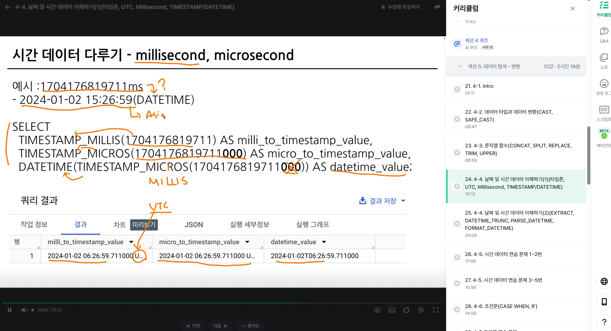

# 📘 SQL_BASIC 5주차 정규 과제

SQL_BASIC 정규 과제는 매주 정해진 분량의 `초보자를 위한 BigQuery(SQL) 입문` 강의를 듣고, 핵심 개념을 정리한 뒤 간단한 SQL 문제를 직접 풀어보는 방식으로 진행합니다.

이번 주는 날짜/시간 데이터와 조건문을 학습합니다. 특히 `CASE WHEN`은 SQL 문제 풀이와 데이터 분석에서 자주 사용되므로, 직접 분류 기준을 만들고 결과를 확인하는 연습을 해주세요.

완성된 과제는 Github에 업로드하고, 링크를 스프레드시트 'SQL' 시트에 입력해 제출해주세요.

**👀 수행 인증란은 필수입니다.**

---

## 📚 SQL_BASIC_5th_TIL

### 섹션 5. 데이터 탐색 - 변환

### 4-4. 날짜 및 시간 데이터 이해하기

### 4-6. 조건문(CASE WHEN, IF)

---

## ✨ 선택 강의

- 4-5. 시간 데이터 연습문제: 날짜/시간 함수를 더 연습하고 싶을 때 선택 수강
- 4-7. 조건문 연습문제: CASE WHEN과 IF를 더 연습하고 싶을 때 선택 수강

---

## 🏁 전체 강의 수강 계획

| 주차 | 필수 강의 범위 | 선택 강의 | 완료 여부 |
| --- | --- | --- | --- |
| 1주차 | 1-1 ~ 2-1 | 1 | ✅ |
| 2주차 | 2-2 ~ 2-3 | 2-4 | ✅ |
| 3주차 | 2-5, 2-7 ~ 2-8 | 2-6 | ✅ |
| 4주차 | 3-2 ~ 4-3 | 3-4 | ✅ |
| 5주차 | 4-4 ~ 4-6 | 4-5, 4-7 | ✅ |
| 6주차 | 5-2 ~ 5-5 | 5-6 | 🍽️ |
| 7주차 | 필수 강의 없음 | 6-2, 6-3, 6-4, 6-5 | 🍽️ |

---

<br>

<!-- 여기까진 그대로 둬 주세요-->

---

# 1️⃣ 개념 정리

아래 키워드 중 중요하다고 생각한 개념을 2개 이상 골라 짧게 정리해주세요. 3개보다 더 많이 정리하고 싶다면 자유롭게 항목을 추가해도 좋습니다.

이번 주 키워드:
- DATE
- DATETIME
- TIMESTAMP
- EXTRACT
- DATETIME_TRUNC
- FORMAT_DATETIME
- CASE WHEN
- IF

## 01.

```
개념 이름: DATE, DATETIME, TIMESTAMP
개념 설명: DATE는 날짜만, DATETIME은 시간대 정보가 없는 날짜와 시각을 저장합니다. TIMESTAMP는 시간대 기준의 절대 시점을 나타내며, BigQuery에서는 UTC 기준으로 저장됩니다.
예시 쿼리: SELECT DATE '2025-01-15' AS date_value, DATETIME '2025-01-15 14:30:00' AS datetime_value, TIMESTAMP '2025-01-15 14:30:00+00' AS timestamp_value;
```

## 02.

```
개념 이름: EXTRACT
개념 설명: 날짜나 시간 값에서 연도, 월, 일, 요일 등 원하는 단위를 숫자로 추출합니다.
예시 쿼리: SELECT EXTRACT(YEAR FROM DATE '2025-01-15') AS year_value;
```

## (선택) 03.

```
개념 이름: CASE WHEN
개념 설명: 조건을 순서대로 검사해 처음 참인 조건에 해당하는 값을 반환합니다. 어떤 조건도 참이 아니면 ELSE 값을 반환합니다.
헷갈린 점: CASE WHEN은 여러 조건을 분류할 때 사용하고, IF는 참과 거짓 두 경우를 간단히 나눌 때 사용합니다. 조건을 여러 개 쓸 때는 더 구체적인 조건을 먼저 적어야 합니다.
```

---

# 2️⃣ 수행 인증란

아래 중 하나 이상을 첨부해주세요.



---

# 3️⃣ 확인 문제

프로그래머스는 로그인이 필요하므로, 로그인 후 문제 풀이를 진행해주세요.

## 🧩 문제 1

문제 링크: [자동차 대여 기록에서 장기/단기 대여 구분하기](https://school.programmers.co.kr/learn/courses/30/lessons/151138)

풀이 과정:

```
- 장기/단기 대여를 나눈 기준: 대여 기간이 30일 이상이면 '장기 대여', 30일 미만이면 '단기 대여'로 구분합니다.
- 사용한 날짜 계산 방식: DATEDIFF(END_DATE, START_DATE)로 날짜 차이를 구합니다. 시작일도 대여 기간에 포함하므로 차이가 29일 이상이면 실제 대여 기간은 30일 이상입니다.
- CASE WHEN으로 만든 컬럼: CASE WHEN DATEDIFF(END_DATE, START_DATE) >= 29 THEN '장기 대여' ELSE '단기 대여' END AS RENT_TYPE
```


## 🧩 문제 2

문제 링크: [한 해에 잡은 물고기 수 구하기](https://school.programmers.co.kr/learn/courses/30/lessons/298516)

풀이 과정:

```
- 문제에서 요구한 연도: 2021년
- 사용한 날짜 조건: TIME >= '2021-01-01' AND TIME < '2022-01-01'로 2021년에 해당하는 범위를 지정합니다.
- 집계한 대상: FISH_INFO 테이블에서 해당 기간에 잡힌 물고기 행의 수를 COUNT(*)로 집계합니다.
```


## 🧩 문제 3

문제 링크: [조건에 부합하는 중고거래 상태 조회하기](https://school.programmers.co.kr/learn/courses/30/lessons/164672)

풀이 과정:

```
- 날짜 조건: CREATED_DATE가 2022년 10월 5일인 게시글만 조회합니다. 날짜 범위로는 CREATED_DATE >= '2022-10-05' AND CREATED_DATE < '2022-10-06'입니다.
- CASE WHEN으로 바꾼 값: STATUS가 'SALE'이면 '판매중', 'DONE'이면 '완료', 'RESERVED'이면 '예약중'으로 표시합니다.
- ELSE에 해당하는 경우: 'SALE'과 'DONE'이 아닌 상태인 'RESERVED'를 '예약중'으로 표시합니다.
- 정렬 기준: 게시글 ID(BOARD_ID)를 내림차순으로 정렬합니다.
```


## 🧩 문제 4

문제 링크: [자동차 평균 대여 기간 구하기](https://school.programmers.co.kr/learn/courses/30/lessons/157342)

풀이 과정:

```
- GROUP BY 기준: 자동차별 대여 기간 평균을 구하기 위해 CAR_ID로 그룹화합니다.
- 평균을 계산한 방식: DATEDIFF(END_DATE, START_DATE) + 1로 시작일을 포함한 대여 일수를 구한 뒤 AVG로 평균을 계산하고, 소수점 첫째 자리까지 반올림합니다.
- HAVING에 사용한 조건: 평균 대여 기간이 7일 이상인 자동차만 남깁니다. HAVING AVG(DATEDIFF(END_DATE, START_DATE) + 1) >= 7 조건을 사용합니다.
- 처음 헷갈렸던 점: DATEDIFF는 시작일과 종료일의 날짜 차이를 반환하므로, 실제 대여 기간을 구할 때 시작일을 포함하려면 1을 더해야 합니다.
```

---

# 4️⃣ 이번 주 회고

```
1. 날짜 함수 중 가장 헷갈린 함수: DATEDIFF입니다. 두 날짜의 차이는 시작일을 포함하지 않으므로, 실제 대여 일수를 구할 때는 1을 더해야 한다는 점이 헷갈렸습니다.
2. CASE WHEN을 사용할 때 기억해야 할 문법: CASE WHEN 조건 THEN 결과를 필요한 만큼 작성하고, 해당하는 조건이 없을 때의 기본값은 ELSE로 지정한 뒤 END로 마무리합니다.
3. 날짜/시간 데이터나 조건문을 활용해보고 싶은 분석 상황: 주문 날짜를 기준으로 월별 매출을 비교하고, 주문 상태나 매출 규모에 따라 데이터를 분류하는 분석에 활용해보고 싶습니다.
```

수고하셨습니다!


